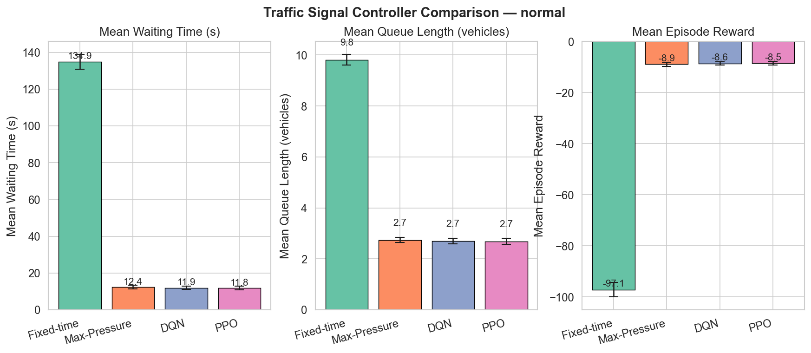
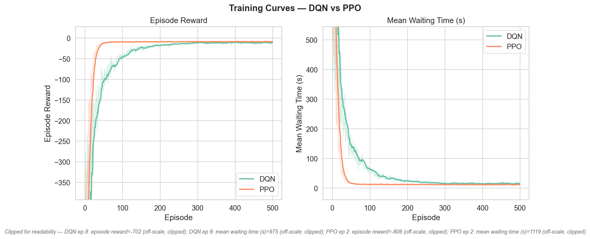
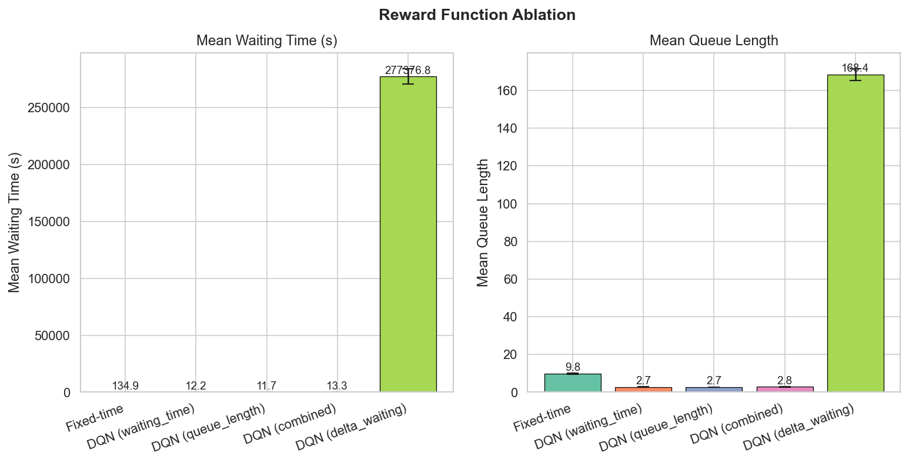
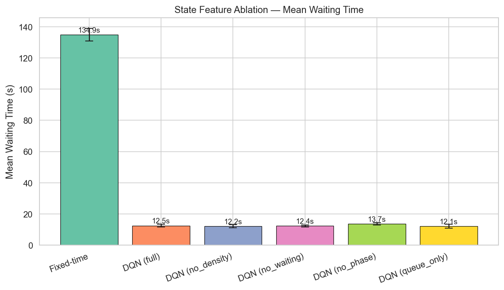

# Deep RL Traffic Signal Control (DQN & PPO)

A reinforcement learning system that learns to control a traffic signal at a 4-way intersection with protected left-turn phases, using [SUMO](https://sumo.dlr.de/) (Simulation of Urban MObility) and PyTorch. Two RL algorithms — **DQN** and **PPO** — are implemented from scratch and benchmarked against both a naive fixed-time baseline and **Max-Pressure** (a strong non-learned control policy from the traffic-signal-RL literature), across multiple traffic scenarios, with reward-function and state-feature ablation studies.

## Results at a Glance

On **balanced traffic** (`normal` scenario), both RL agents essentially match Max-Pressure — a strong non-learned baseline from the traffic-signal-RL literature — and all three crush the naive fixed-time schedule, evaluated over 5 held-out stochastic traffic realizations (mean ± std):

| Controller | Mean wait (s) | vs. fixed-time |
|---|:---:|:---:|
| Fixed-time (naive baseline) | 134.9 ± 4.0 | — |
| Max-Pressure (strong static baseline) | 12.4 ± 1.1 | **−90.8%** |
| DQN | 11.9 ± 0.9 | **−91.2%** |
| PPO | 11.8 ± 1.0 | **−91.2%** |



**Training dynamics differ sharply between the two algorithms** — PPO converges to near-optimal performance by ~episode 60-70, while DQN takes roughly 250-300 episodes to catch up, consistent with PPO's on-policy updates giving smoother (if less sample-efficient) learning versus DQN's epsilon-greedy exploration:



Evaluation runs each controller on the **same set of held-out traffic seeds** (Poisson vehicle arrivals — every episode is a different traffic realization, disjoint from the seeds used in training), so the error bars reflect genuine variability across traffic conditions rather than a replayed identical episode.

### It's not all good news: distribution shift under saturation

Evaluated on the `high` scenario (800 veh/hr per direction, both agents trained only on `normal`-scenario traffic), the RL agents' advantage **inverts**:

| Controller | Mean wait (s) | vs. fixed-time |
|---|:---:|:---:|
| Fixed-time | 3069 ± 7 | — |
| Max-Pressure | 2301 ± 175 | **+25.0%** |
| PPO | 5680 ± 2079 | **−85.1%** (worse) |
| DQN | 22245 ± 27585 | **−624.7%** (much worse) |

Under saturation, Max-Pressure — which makes no assumptions about the traffic distribution it was tuned on — still beats fixed-time. DQN and PPO, trained almost entirely on `normal`-scenario traffic, generalize badly to a substantially heavier load their training distribution barely covered; DQN in particular appears to have learned policies that actively worsen an already-saturated intersection. This is a textbook RL distribution-shift failure, and a genuine limitation of training on a single scenario — the fix (train across a mixture of scenarios, or evaluate generalization explicitly) is future work, not something this project currently does. Reporting a controller's worst case, not just its best, is the point of testing more than one scenario.

## Network Upgrade: Protected Left Turns

The original network gave each approach 2 shared lanes and the signal only 2 phases (NS / EW), so left-turning traffic just merged into the same phase as through traffic — some of the residual delay in the original results was unavoidable turning-conflict delay that no phase-selection policy could remove, because the phases needed to separate it didn't exist.

Each incoming approach now has **3 lanes** (dedicated left-turn lane, through lane, through+right lane) and **2 lanes outgoing**. SUMO's default lane-connection guesser assigns lane-to-movement connections 1:1 when lane count matches destination count, and its default TLS builder responds to the dedicated left lane by adding **protected left-turn phases** automatically — no explicit connection/phase-logic file needed. This produces **4 green phases** (NS main including permitted left, NS protected-left, EW main, EW protected-left) instead of 2. `traffic_env.py`'s `_discover_phases()` already read whatever phases came out of the network, so the action space (2 → 4) and state size (15 → 17, the phase one-hot grew) adapt automatically — no agent code changes were needed, only `network/generate_network.py`.

One consequence worth flagging honestly: more phases means more ways for training to go briefly wrong. A near-random policy (e.g. very early in training) can leave a direction starved of green for long enough, combined with SUMO's `time-to-teleport` being disabled (see [Correctness Notes](#correctness-notes)), to gridlock a queue that doesn't clear for the rest of the episode — this happened once on the 2-phase network after ~450 episodes of training; on the 4-phase network it's visible even with 2 near-random training episodes, evaluating in the hundreds-of-thousands-of-seconds range. This isn't a bug — a reasonable fixed-time schedule keeps the same network well under control — but it does mean training stability over the first ~100-200 episodes is worth watching, not just the final result.

---

## Project Structure

```
traffic/
├── configs/
│   └── config.yaml              # All hyperparameters and paths
├── env/
│   └── traffic_env.py           # Gymnasium environment wrapping SUMO via traci
├── agents/
│   ├── base_agent.py            # Abstract interface + GPU/CPU selector
│   ├── dqn_agent.py             # DQN: Q-network, replay buffer, epsilon-greedy
│   └── ppo_agent.py             # PPO: actor-critic, rollout buffer, GAE
├── baselines/
│   ├── fixed_time.py            # Naive fixed-cycle signal controller
│   └── max_pressure.py          # Strong non-learned baseline (Max-Pressure control)
├── network/
│   ├── generate_network.py      # Generates SUMO .xml files and route files
│   └── single/                  # Generated network files (created by step 2)
│       ├── single.net.xml
│       ├── routes_normal.rou.xml
│       ├── routes_ns_peak.rou.xml
│       ├── routes_ew_peak.rou.xml
│       ├── routes_high.rou.xml
│       └── single.sumocfg
├── training/
│   ├── train.py                 # DQN and PPO training loops with MLflow + TensorBoard
│   ├── evaluate.py              # Runs trained agents, compares to baseline, saves plots
│   └── plot_curves.py           # Training-curve plots from MLflow run history
├── tests/
│   ├── test_fixed_time.py       # Fixed-time baseline schedule correctness
│   ├── test_max_pressure.py     # Max-Pressure phase-pressure computation
│   ├── test_dqn.py              # Q-network, replay buffer, epsilon schedule
│   └── test_ppo.py              # Actor-critic shapes, GAE correctness + bootstrapping
├── experiments/
│   ├── reward_ablation.py       # Experiment: which reward function works best?
│   └── state_ablation.py        # Experiment: which state features matter most?
├── scripts/
│   └── run_pipeline.py          # Runs the full retrain+eval+ablation sequence
│                                 # end to end; resumable via --start-from
├── results/
│   ├── checkpoints/             # Saved model weights (.pt files)
│   ├── metrics/                 # CSV files with evaluation numbers
│   ├── plots/                   # PNG comparison charts
│   └── tensorboard/             # TensorBoard event files
└── mlruns/                      # MLflow run history
```

---

## Quick Start

Run these commands from the project root (`Documents/traffic/`) in order:

```bash
# 1. Install dependencies
pip install -r requirements.txt

# 2. Run the unit tests (no SUMO needed)
python -m pytest tests/

# 3. Generate the SUMO network and route files
python network/generate_network.py

# 4. Train DQN (500 episodes, ~1 hr)
python training/train.py --algo dqn

# 5. Train PPO (500 episodes, ~45 min)
python training/train.py --algo ppo

# 6. Evaluate both agents vs. fixed-time baseline
python training/evaluate.py

# 7. Plot training curves from the MLflow logs
python training/plot_curves.py

# 8. Reward function ablation experiment
python experiments/reward_ablation.py

# 9. State feature ablation experiment
python experiments/state_ablation.py
```

All steps are idempotent — re-running overwrites previous outputs.

---

## The Simulation

**SUMO** simulates a single 4-way intersection with a traffic light named `center`. There are 4 incoming edges (N2C, S2C, E2C, W2C) and 4 outgoing edges. Each incoming edge has 3 lanes (dedicated left-turn lane, through, through+right); outgoing edges have 2. Speed limit is 50 km/h (13.89 m/s). Each edge is 300 m long.

Each simulated episode covers **1 hour of traffic** (3600 simulated seconds). The RL agent makes a decision every 5 seconds (`delta_time = 5`), giving 720 steps per episode.

**Episodes are stochastic.** Vehicle arrivals are Poisson processes (`period="exp(rate)"` in the route files) and drivers have randomized speed factors, so each episode — driven by a per-episode SUMO seed — is a different traffic realization. Training uses seeds `42 + episode`; evaluation uses a disjoint held-out seed range (`10000+`), the same for every controller so comparisons are paired.

---

## The Environment (`env/traffic_env.py`)

The environment follows the [Gymnasium](https://gymnasium.farama.org/) API (`reset`, `step`, `close`).

### Observation (State)

At each step, the agent sees a vector built from the following features, all normalized to [0, 1]:

| Feature | Source | Normalization cap |
|---------|--------|-----------------|
| Queue length per edge (×4) | Halting vehicles on each incoming edge | 30 vehicles |
| Density per edge (×4) | Lane occupancy percentage | 100% |
| Waiting time per edge (×4) | Cumulative seconds vehicles have been waiting | 300 s |
| Current phase (one-hot, ×4) | Which green phase is active | — |
| Phase duration (×1) | Seconds in current phase | 120 s |

Default state vector size: **17 values** (4+4+4+4+1). The phase one-hot width — and therefore total state size and action-space size — is auto-detected from whatever the generated network's traffic light program actually contains (`_discover_phases()` in `traffic_env.py`), not hardcoded.

### Action

`Discrete(4)` — choose which green phase to activate. Auto-discovered from the network's traffic light program, not hardcoded:
- Phase 0: NS main (through + right, left permitted/yielding)
- Phase 1: NS protected left turn
- Phase 2: EW main (through + right, left permitted/yielding)
- Phase 3: EW protected left turn

**Yellow transitions are inserted automatically** — when the agent switches phases, the environment inserts a 3-second yellow before activating the new green. The agent does not need to handle this.

**Minimum green enforcement** — the agent cannot switch phases until the current phase has accumulated at least `min_green` (10) seconds of green. If it tries, the action is overridden to keep the current phase. Because decisions happen on a 5-second grid and a switch step yields only 2 s of green (3 s go to yellow), green time quantizes to 2+5k seconds — so the effective minimum is 12 s, the smallest reachable value ≥ 10.

### Reward

Five options, set via `reward.type` in `config.yaml`:

| Type | Formula | What it optimizes |
|------|---------|-----------------|
| `waiting_time` | `−Σ waiting_time` across all edges | Minimize total seconds vehicles wait |
| `queue_length` | `−Σ queue_length` across all edges | Minimize total vehicles stuck |
| `combined` | `−(0.5 × waiting + 0.5 × queue)` | Weighted combination |
| `pressure` | `−|queue_red_edges − queue_green_edges|` | Serve the most congested direction |
| `delta_waiting` | `waiting_time[t-1] − waiting_time[t]` | Change in cumulative delay (sumo-rl's default reward) |

`delta_waiting` is bounded per-step regardless of how congested the intersection has become, unlike `waiting_time`/`queue_length`/`combined` which grow with the absolute backlog — a step that clears part of a bad jam looks the same magnitude as a step that helps in light traffic, giving cleaner credit assignment. See `experiments/reward_ablation.py` for a head-to-head comparison against the other reward types.

All rewards are scaled by `reward.scale = 0.001` to keep values in a stable range for neural network training.

---

## Traffic Scenarios (Route Files)

Four scenarios are generated by `generate_network.py`, each representing different real-world conditions:

| File | Description | N↕S flow | E↔W flow |
|------|------------|---------|---------|
| `routes_normal.rou.xml` | Balanced traffic, moderate volume | 300 veh/hr | 300 veh/hr |
| `routes_ns_peak.rou.xml` | Morning rush, North-South dominant | 600 veh/hr | 200 veh/hr |
| `routes_ew_peak.rou.xml` | Evening rush, East-West dominant | 200 veh/hr | 600 veh/hr |
| `routes_high.rou.xml` | High congestion, all directions saturated | 800 veh/hr | 800 veh/hr |

To train on a specific scenario:
```bash
python training/train.py --algo dqn --scenario ns_peak
python training/evaluate.py --scenario ew_peak
```

**To add a new scenario:** open `network/generate_network.py`, add an entry to the `scenarios` dict in `write_route_file()`, then re-run `python network/generate_network.py`. The new `.rou.xml` file will appear in `network/single/`. No other files need to change.

---

## The Agents

### DQN (`agents/dqn_agent.py`)

**Deep Q-Network** — an off-policy, value-based method.

How it works:
1. At each step, pick an action using **epsilon-greedy**: with probability ε, explore randomly; otherwise, pick the action with the highest predicted Q-value.
2. Store the experience `(state, action, reward, next_state, done)` in a **replay buffer** (capacity 50,000).
3. Every step, sample a random mini-batch of 64 experiences and update the Q-network using the Bellman equation: `Q(s,a) = r + γ · max Q'(s', a')`.
4. The loss function is **Huber loss** (smoother than MSE for large errors).
5. A separate **target network** provides stable Q-value targets. It is hard-copied from the online network every 200 update steps.
6. Epsilon decays from 1.0 → 0.05 **per episode** (`epsilon_decay = 0.99`, floor reached ~episode 300 of 500). Decaying per learn-step — the common tutorial pattern — would exhaust exploration within ~8 episodes here (720 learn steps/episode).
7. Episodes end by **time limit**, which is not a true terminal state — so the Q-target still bootstraps `max Q(s′,·)` across episode boundaries instead of zeroing it (Pardo et al. 2018, *Time Limits in Reinforcement Learning*).

Network architecture: `input(17) → Linear(256) → ReLU → Linear(256) → ReLU → Linear(4)`

Key hyperparameters (`config.yaml` under `dqn:`):
- `lr: 0.001` — Adam learning rate
- `gamma: 0.99` — discount factor (how much future rewards matter)
- `buffer_size: 50000` — replay buffer capacity
- `target_update: 200` — steps between target network syncs

### PPO (`agents/ppo_agent.py`)

**Proximal Policy Optimization** — an on-policy, actor-critic method.

How it works:
1. Collect a **rollout** of 2048 steps using the current policy.
2. Compute **GAE (Generalized Advantage Estimation)** — a credit assignment method that balances bias vs. variance when estimating how good each action was. When the rollout cuts off mid-episode, the tail is **bootstrapped with the critic's `V(s)`** rather than treated as a terminal; time-limit truncations inside a rollout are handled with partial-episode bootstrapping (the discounted `V(s_next)` is folded into the final reward).
3. Normalize advantages across the rollout batch.
4. Run **10 epochs** of mini-batch updates over the collected data. Each update uses the **clipped surrogate objective** to prevent the policy from changing too drastically in one step (clip_epsilon = 0.2).
5. The loss combines: policy gradient + value function error + entropy bonus (encourages exploration).

Network architecture: shared trunk `input(17) → Linear(256) → ReLU → Linear(256) → ReLU`, then two heads — `actor: Linear(256) → Linear(4)` and `critic: Linear(256) → Linear(1)`.

Key hyperparameters (`config.yaml` under `ppo:`):
- `lr: 3e-4` — Adam learning rate
- `gae_lambda: 0.95` — GAE smoothing (higher = lower variance, more bias)
- `clip_epsilon: 0.2` — maximum policy change per update
- `entropy_coef: 0.01` — exploration bonus weight
- `rollout_steps: 2048` — steps collected before each policy update

### Why both DQN and PPO?

DQN and PPO represent two fundamentally different RL paradigms:
- **DQN** learns a value function (how good is each action?) and is sample-efficient due to experience replay.
- **PPO** learns a policy directly and tends to be more stable but less sample-efficient.

Comparing them on the same task demonstrates which paradigm performs better for traffic control and provides a stronger portfolio result.

---

## The Baselines

### Fixed-time (`baselines/fixed_time.py`)

A **fixed-time controller** that cycles through phases with an equal time split — with 4 phases now, 15 seconds each in a 60-second cycle — regardless of traffic conditions. This is what most real-world traffic signals used before adaptive control, and it's a deliberately naive comparison target: with more phases, an equal split gets *more* wasteful (protected-left phases don't need as much green time as the main through phases), which is realistic but means beating it by a wide margin isn't a strong claim on its own.

### Max-Pressure (`baselines/max_pressure.py`)

A **static (non-learned) Max-Pressure controller** — at every decision point, it picks the candidate phase whose served movements have the largest "pressure": queued vehicles on the incoming lanes that phase would serve, minus queued vehicles on the corresponding outgoing lanes. Max-Pressure ([Varaiya, 2013](https://en.wikipedia.org/wiki/Max-pressure_controller)) requires no training and is provably throughput-maximizing under mild assumptions; it's the standard strong non-learned baseline used throughout the traffic-signal-RL literature (RESCO, PressLight, MPLight). **This is the fair comparison** — beating a naive fixed-time schedule is easy, beating Max-Pressure is the real test of whether the learned policy earned its complexity.

The pressure computation is factored into a pure function (`compute_phase_pressures`) that takes plain data (phase state strings, controlled-link tuples, a queue-lookup callable) so it's unit-testable without a running SUMO instance — see `tests/test_max_pressure.py`.

---

## Training Loop (`training/train.py`)

Both algorithms share the same entry point. The training loop:
1. Seeds all random number generators for reproducibility (`seed: 42`).
2. Builds the environment and discovers its state/action sizes.
3. Creates the agent and tracking writers (MLflow + TensorBoard).
4. Runs episodes, logging `episode_reward`, `mean_waiting_time`, `mean_queue_length`, and agent-specific metrics (epsilon for DQN, policy/value loss for PPO) at every episode.
5. Saves the **best checkpoint** (highest cumulative reward) and periodic checkpoints every 100 episodes.

To watch training in the SUMO GUI:
```bash
python training/train.py --algo dqn --gui
```

To view metrics during or after training:
```bash
# TensorBoard
tensorboard --logdir results/tensorboard

# MLflow
mlflow ui --backend-store-uri mlruns
# then open http://localhost:5000
```

---

## Evaluation (`training/evaluate.py`)

Runs each controller (Fixed-time, **Max-Pressure**, DQN, PPO) for 5 episodes without exploration and computes mean ± std for:

> **Fair comparison:** every controller is evaluated on the *same* held-out traffic seeds (10000–10004), disjoint from the training seed range — so differences between controllers are paired comparisons across identical traffic demand, and the reported std reflects real episode-to-episode variability. Max-Pressure in particular is the meaningful bar to clear: it's a strong non-learned policy, not a strawman.

- Mean waiting time (seconds)
- Mean queue length (vehicles)
- Max waiting time (seconds)
- Episode reward

Outputs (per scenario; `normal` gets no filename suffix, others do, e.g. `_high`):
- `results/metrics/evaluation_results.csv`
- `results/plots/comparison.png`

```bash
# Evaluate on a different scenario
python training/evaluate.py --scenario high --episodes 10

# Evaluate multiple scenarios in one run (produces comparison.png +
# comparison_high.png, etc.)
python training/evaluate.py --scenarios normal,high
```

---

## Experiments

### Experiment 1: Reward Function Ablation (`experiments/reward_ablation.py`)

Trains DQN four times — once with each reward type (`waiting_time`, `queue_length`, `combined`, `delta_waiting`) — and evaluates all four. This answers: **does the choice of reward signal matter, and which performs best in terms of actual waiting time?**



| Reward type | Mean wait (s) |
|---|:---:|
| `waiting_time` | 12.2 ± 0.9 |
| `queue_length` | 11.7 ± 0.9 |
| `combined` | 13.3 ± 1.2 |
| `delta_waiting` | 277,377 ± 6,502 (**total gridlock**) |

The first three are statistically indistinguishable — reward choice barely matters among the direct-magnitude formulations. `delta_waiting` is the interesting result: it **trained smoothly** (loss curves look completely normal, episode reward stays near zero throughout because the reward is bounded per-step by design) but the resulting *greedy* policy gridlocks the intersection almost immediately at evaluation time. The likely mechanism: because `delta_waiting = waiting[t-1] - waiting[t]` only rewards the *marginal change* in congestion, a policy that keeps the intersection permanently near-saturated can still score close to zero every step as long as it doesn't make things measurably worse turn-by-turn — there's no term anywhere in the reward that penalizes the *absolute* backlog. Sound in theory (it's literally sumo-rl's own default reward), broken in practice for this exact env/reward-scale combination. This is worth keeping if you're citing this project: `delta_waiting` is not simply "the more sophisticated option" — it needs to be paired with something that anchors absolute congestion (e.g. `combined` with a delta component) to avoid this failure mode.

Output: `results/metrics/reward_ablation.csv`, `results/plots/reward_ablation.png`

### Experiment 2: State Feature Ablation (`experiments/state_ablation.py`)

Trains DQN five times with different subsets of state features:

| Variant | Features included |
|---------|-----------------|
| `full` | queue + density + waiting_time + phase (baseline) |
| `no_density` | queue + waiting_time + phase |
| `no_waiting` | queue + density + phase |
| `no_phase` | queue + density + waiting_time |
| `queue_only` | queue + phase only |

This answers: **which features are actually necessary? Can we get away with a simpler state?**



| Variant | Mean wait (s) |
|---|:---:|
| `full` | 12.5 ± 0.9 |
| `no_density` | 12.2 ± 1.1 |
| `no_waiting` | 12.4 ± 0.6 |
| `no_phase` | 13.7 ± 0.7 |
| `queue_only` | 12.1 ± 1.2 |

Key finding, and it holds up even on the more complex 4-phase network: **four of the five state variants are statistically indistinguishable**; `no_phase` is the one exception, nominally worse and with a visibly larger max-wait (165s vs. ~90-100s for the others in the underlying CSV) — consistent with the theoretical expectation that not knowing which direction currently has right-of-way is the one piece of information a controller genuinely cannot do without. Beyond that, `queue_only` (the simplest state tested — just queue length + phase) performs indistinguishably from `full`. This means queue length is close to a sufficient statistic for this single-intersection MDP, and the extra features (density, cumulative waiting time) aren't earning their keep here. A harder setting — the multi-intersection grid, or a state-aliasing scenario deliberately designed to need those features — would be needed to actually separate these variants further.

Output: `results/metrics/state_ablation.csv`, `results/plots/state_ablation.png`

---

## Configuration Reference (`configs/config.yaml`)

All behavior is controlled by a single YAML file. Key sections:

| Section | Key | What it does |
|---------|-----|-------------|
| `sumo` | `gui: false` | Set to `true` to watch simulation in SUMO GUI |
| `sumo` | `yellow_time: 3` | Duration of yellow light between phase changes |
| `sumo` | `simulation_seconds: 3600` | How long each simulated episode is |
| `environment` | `delta_time: 5` | Seconds between agent decisions |
| `environment` | `min_green: 10` | Minimum green time before the agent can switch |
| `state` | `use_density: true` | Toggle per-feature inclusion (used by state ablation) |
| `reward` | `type: "waiting_time"` | Reward function: `waiting_time / queue_length / combined / pressure` |
| `dqn` | `epsilon_decay: 0.99` | Per-episode exploration decay (floor ~episode 300) |
| `training` | `num_episodes: 500` | Total training episodes |
| `training` | `log_interval: 25` | Print progress every N episodes |
| `training` | `device: "auto"` | `"auto"` uses GPU if available, else CPU |

---

## Outputs Summary

| File | Created by | Contents |
|------|-----------|---------|
| `results/checkpoints/dqn_best.pt` | `train.py --algo dqn` | Best DQN weights |
| `results/checkpoints/ppo_best.pt` | `train.py --algo ppo` | Best PPO weights |
| `results/checkpoints/{algo}_latest.pt`, `{algo}_progress.json` | `train.py --resume` | Resume checkpoint + episode/best-reward sidecar |
| `results/metrics/evaluation_results.csv` | `evaluate.py` | Fixed-time vs Max-Pressure vs DQN vs PPO, `normal` scenario |
| `results/metrics/evaluation_results_high.csv` | `evaluate.py --scenarios normal,high` | Same, `high`-demand scenario |
| `results/metrics/reward_ablation.csv` | `reward_ablation.py` | Per-reward-type metrics |
| `results/metrics/state_ablation.csv` | `state_ablation.py` | Per-feature-set metrics |
| `results/plots/comparison.png` / `comparison_high.png` | `evaluate.py` | Bar chart: 4-controller comparison, per scenario |
| `results/plots/training_curves.png` | `plot_curves.py` | Episode reward / waiting time vs. episode, DQN vs PPO |
| `results/plots/reward_ablation.png` | `reward_ablation.py` | Bar chart: reward variants |
| `results/plots/state_ablation.png` | `state_ablation.py` | Bar chart: state variants |

---

## Adding New Route Scenarios (Future Work)

To experiment with custom traffic patterns, add a new entry to the `scenarios` dict in `network/generate_network.py`:

```python
"my_scenario": {
    "N2S": 400, "S2N": 200,   # vehicles per hour, N→S and S→N through traffic
    "E2W": 400, "W2E": 400,
    "N2E": 80,  "N2W": 80,    # right/left turns
    "S2E": 80,  "S2W": 80,
    "E2N": 80,  "E2S": 80,
    "W2N": 80,  "W2S": 80,
},
```

Then re-run `python network/generate_network.py`. The file `network/single/routes_my_scenario.rou.xml` will be created. You can then pass `--scenario my_scenario` to `train.py` and `evaluate.py`.

---

## Correctness Notes

RL implementations fail silently — the agent still "learns something" even when the math is subtly wrong. Three such issues were found and fixed in this project; they're documented here because they're instructive:

1. **Time-limit truncation ≠ terminal state.** Episodes end after 1 simulated hour, but traffic doesn't cease to exist at that moment. Treating the cutoff as a terminal state (`done=1` in the Bellman target) teaches the agent that the world ends at step 720, biasing values near episode end. Fix: DQN bootstraps `max Q(s′,·)` across truncations; PPO folds `γ·V(s_next)` into the final reward (partial-episode bootstrapping, Pardo et al. 2018).
2. **GAE must bootstrap the rollout tail.** PPO's 2048-step rollouts cut off mid-episode. The last transition's advantage must use the critic's `V(s)` for the state the env is left in — hard-coding 0 there treats every rollout boundary as an episode end.
3. **Per-step epsilon decay exhausts exploration almost immediately.** With 720 learn steps per episode, a 0.9995 per-step decay hits the exploration floor after ~8 of 500 episodes. Decay is per-episode (0.99), reaching the floor around episode 300.

Additionally, evaluation originally used deterministic, equally-spaced vehicle insertions — every "episode" was the identical scenario replayed, making mean ± std over 5 episodes meaningless (std was exactly 0). Route files now use Poisson arrivals with per-episode SUMO seeds, so evaluation statistics reflect genuine variability. One side effect worth calling out: with stochastic evaluation, the state-ablation ranking from before this fix no longer holds — see the [State Feature Ablation](#experiment-2-state-feature-ablation-experimentsstate_ablationpy) results below, which now show the five variants performing indistinguishably rather than a clear "phase matters most" trend. That original conclusion was almost certainly noise from a single deterministic rollout.

**A known failure mode, found via the training curves, not hidden from them:** DQN episode 448 (seed 490) shows a queue length of 16.3 vehicles and mean waiting time of 1275s — both roughly 5–100x the typical value. SUMO's `time-to-teleport` is disabled (`-1`) in this project so gridlocked vehicles are never force-removed, which is realistic but means a sufficiently bad sequence of actions — most likely a random exploration action landing at the wrong moment during a high-arrival-rate seed — can trigger a queue buildup the agent doesn't clear before the episode's 1-hour time limit. It's a single episode out of 500 and training recovers immediately after, but it's a real limitation of a fixed-horizon single-intersection formulation: there's no mechanism forcing the agent to prioritize clearing an already-large queue over marginal further reward. `training/plot_curves.py` clips the y-axis to the 1st–99th percentile so this doesn't dominate the plot, and annotates which point was clipped.

## Resumable Training (`training/train.py --resume`, `scripts/run_pipeline.py`)

A full training run (500 episodes) takes over an hour — long enough that it can outlast whatever environment it's running in. Every `latest_interval` episodes (config: `training.latest_interval`, default 20), the training loop saves `{algo}_latest.pt` plus a small JSON progress sidecar (`{algo}_progress.json`: episode number, best reward so far). `--resume` picks both back up: an interrupted run loses at most `latest_interval` episodes rather than restarting from scratch. `experiments/reward_ablation.py --resume` and `experiments/state_ablation.py --resume` get the same behavior for free — each ablation variant reuses the exact same `_train_dqn` training loop (rather than a duplicated copy) with its own checkpoint subdirectory.

`scripts/run_pipeline.py` chains network generation → DQN training → PPO training → evaluation → training-curve plotting → reward ablation → state ablation, always passing `--resume` to every training/ablation step, and supports `--start-from "<step name>"` to skip already-completed steps entirely after an interruption:

```bash
python scripts/run_pipeline.py                          # full run, ~5-6 hrs
python scripts/run_pipeline.py --core-only               # skip ablations, ~2 hrs
python scripts/run_pipeline.py --start-from "Train PPO"  # resume after an interruption
```

Two infrastructure bugs surfaced (and got fixed) while stress-testing this against repeated interruptions — worth knowing about if you extend the pipeline script:

- **Matplotlib's default GUI backend can hang in a headless/background process.** This machine's default backend is `TkAgg`, which needs a window session to initialize; a detached background process doesn't have one. Every script that plots now calls `matplotlib.use("Agg")` before importing `pyplot`.
- **Streaming a subprocess's output without an explicit encoding silently uses the wrong one.** `subprocess.Popen(..., text=True)` without `encoding=` decodes the child's stdout using the *parent's* default locale (`cp1252` on Windows), not whatever encoding the child is actually writing in (`utf-8`, forced via `PYTHONIOENCODING`) — non-ASCII output (box-drawing characters, em dashes) then crashes the parent outright. Fixed by passing `encoding="utf-8", errors="replace"` explicitly to `Popen`.

## Testing

```bash
python -m pytest tests/
```

24 unit tests cover the pieces that can fail silently: fixed-time schedule arithmetic, replay-buffer capacity/shapes, epsilon schedule (including a regression test for the per-step-decay bug), Q-network/actor-critic output shapes, hand-verified GAE computations (reward-to-go, episode-boundary cutting, tail bootstrapping), and Max-Pressure's phase-pressure computation (downstream subtraction, permitted vs. protected green, red-link exclusion). No SUMO installation is needed to run them.

## Roadmap: Multi-Agent 3×3 Grid

The network generator has a `--grid` flag stub ready. The next phase extends this to a 3×3 grid of 9 coordinated intersections — one agent per intersection with a shared observation-space design, which is where the DQN-vs-PPO comparison should genuinely diverge.

## License

MIT — see [LICENSE](LICENSE).
